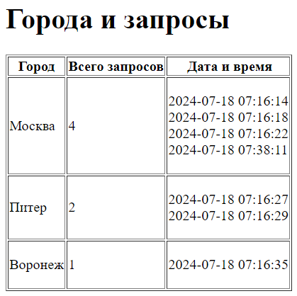

# Приложение "Погода"

https://github.com/InAnotherLife/weather

https://t.me/JohnWooooo

## О проекте
Веб-приложение позволяет пользователю вводить название города и получать прогноз погоды на ближайшие 14 дней.\
Приложение разработано на языке Python версии 3.9 с использованием фреймворка Flask. Для работы с БД использовалось расширение Flask-SQLAlchemy.\
Веб-приложение использует АПИ для получения погоды https://open-meteo.com/. Для созранения истории запросов погоды используются сессии фреймворка Flask.\
Код программы находится в папке src.

## Стек
* Python 3.9
* Flask 3.0.3
* Flask-SQLAlchemy 3.1.1
* GeoPy 2.4.1

## Запуск приложения
В корне проекта создать файл .env. Пример заполнения файла:
```
SECRET_KEY='secret_key'
```

Необходимо создать и активировать виртуальное окружение:
```
python -m venv venv
source venv/Scripts/activate
```

Установить зависимости из файла requirements.txt:
```
pip install -r requirements.txt
```

Перейти в папку src и запустить приложение:
```
cd src
python server.py
```

## Работа с приложением
На главной странице веб-приложения пользователь вводит город и получает прогноз погоды на ближайшие 14 дней.


Для каждого пользователя сохраняется история запросов погоды.


Также можно посмотреть подробную статистику запросов прогноза погоды.


